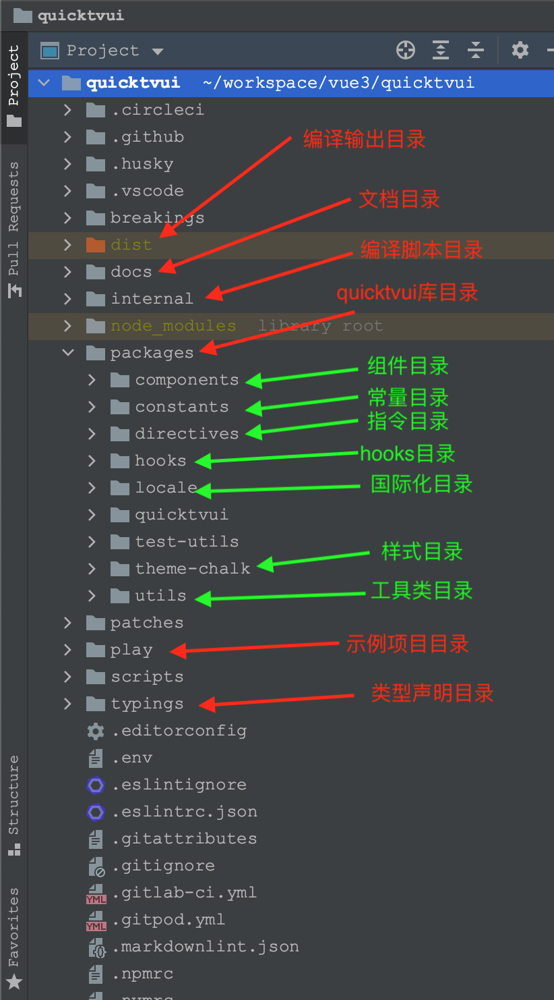

# 开始

项目结构



## 第一步、安装`pnpm`

项目使用`pnpm`包管理器。

[官网](https://pnpm.io)

[安装参考文档](https://pnpm.io/installation)

## 第二步、安装依赖库

项目根目录下执行 `pnpm i`

采用`pnpm workspace`管理`monorepo`项目。

[参考文档](https://pnpm.io/pnpm-workspace_yaml)

[pnpm 如何使用 workspace 构建 monorepo](https://ksh7.com/posts/pnpm-use-workspace/index.html)

## 第三步、编译项目

运行项目根目录下的`packages.json`中的`build`命令

```
pnpm run build
```

## 第四步、运行文档

进入项目`doc`目录下，执行`packages.json`中的`dev`命令

```
pnpm run dev
```

## 第五步、运行示例项目

运行项目根目录下的`packages.json`中的`dev`命令

```
pnpm run dev
```

## 附录

### Node 升级与降级

[参考文档](https://quicktvui.com/zh-CN/guide/node/install.html)

### npm 升级与降级

[参考文档](https://quicktvui.com/zh-CN/guide/npm/install.html)

### 自定义组件流程

参考项目根目录下[`CONTRIBUTING_COMPONENT.md`](./CONTRIBUTING_COMPONENT.md)

### 参考资料

参考项目根目录下[`REFERENCE.md`](./REFERENCE.md)

### 常见问题

参考项目根目录下[`ISSUES.md`](./ISSUES.md)


